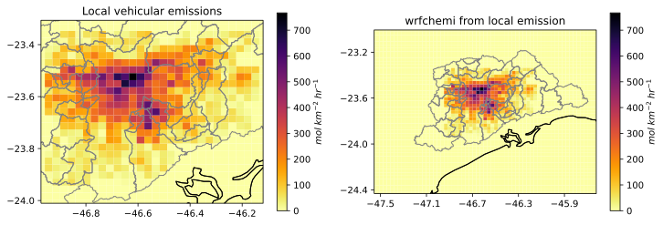

# PyChEmiss

`PyChEmiss` is a Python script to create the `wrfchemi` file from local emissions needed to run WRF-Chem model. It's based on his older broder [AAS4WRF.ncl](https://github.com/alvv1986/AAS4WRF).


## Installation

You need to install the packages that `PyChEmiss` needs. We recommend to use
[miniconda](https://docs.conda.io/en/latest/miniconda.html) or
[anaconda](https://docs.anaconda.com/anaconda/install/)

You can download this repo or clone it by:

```
git clone https://github.com/quishqa/PyChEmiss.git
```

Then add `conda-forge` channel by:

```
conda config --add channels conda-forge
```

To avoid conflicts during the installation, we also recommend create a new environment to run `PyChEmiss`:

```
conda create --name PyChEmiss
conda activate PyChEmiss
```


### Option A

Now you can install `espmy`, `xesmf` and `pyyaml`. By doing this, `xarray`,
`numpy`,  and `pandas`will be also installed:

```
conda install esmpy
conda install xesmf
conda install pyyaml
```

It's important to first install `esmpy` to avoid [this issue](https://github.com/JiaweiZhuang/xESMF/issues/47#issuecomment-593322288).


### Option B
Or, you can install the packages located in `requirements.txt` by typing:

```
conda install --yes --file requirements.txt
```

If everything goes well, you are ready to go.

## The input data
To run this script you need the `wrfinput_d0x` and your temporal and spatial disaggregated emissions in **mol/km<sup>2</sup>/hr**. You can see the needed format by exploring `emissions_3km.txt` file.

To untar the example files:
```
tar -zxvf emissions_3km.tar.gz
tar -zxvf wrfinput_d02.tar.gz
```

## Configuration file: `pychemiss.yml`
This file controls some parameters to run the script. `""` are required only in `sep`.
* `wrfinput_file`: the location of wrfinput_d0x.
* `emission_file`: the location of the local emission file.
* `nx` and `ny`: the number of longitude and latitude points in which local emission were spatially disaggregated.
* `cell_area`: cell area in km<sup>2</sup> of input `emission_file`.
* `start_date` and `end_date`: `emissions_3km.txt` temporal availability in `%Y-%m-%d %H:%M` format.
* `header`: If your local emission file has a header.
* `col_names`: Names of emission file column names. **Remember that the three
first columns have to be named "i", "lon", and "lat"**.
* `sep`: Column delimiter in emission file. Use quotes (`""`)
* `method`: we implement `nearest_s2d` methods for emissions regridding
(a conservative method is on the way!).
* `output_name` : location and name of produced `wrfchemi` file (`wrfchemi_d02_pychemiss`)

## Usage

To run the script, type:
```
python pychemiss.py pychemiss.yml
```

To check that everything is working properly up to this point, we recommend to visualize the content of the output file, for example, by using `ncview`
```
ncview wrfchemi_d02_pychemiss
```

### WRF-Chem namelist configuration

To use the `wrfchemi` file in a standard WRF-Chem simulation, change its name from `wrfchemi_d02_pychemiss` to `wrfchemi_d<domain>_<date>` (`wrfchemi_d01_2018-06-21_00:00:00` in this example) and set some control parameters in the `namelist.input` file as follows
```
&time_control
io_form_auxinput5                   = 2,
auxinput5_inname                    = 'wrfchemi_d<domain>',
auxinput5_interval_m                = 60,
frames_per_auxinput5                = 240,
/

&chem
io_style_emissions                  = 2,
/
```

240 is the number of times (hours) in the `wrfchemi` file.

For 24 hours of emissions data, the preprocessor will automatically build two 12-hour emission files: `wrfchemi_00z_d02` (00 to 11 UTC) and `wrfchemi_12z_d02` (12 to 23 UTC). In this case, set `frame_per_auxinput5` to 12 and `io_style_emissions` to 1.

### Output example
Here there is a comparison between the local emission of CO (with &Delta;X= 3 Km) and the
output after using `pychemiss.py` for a WRF domain of &Delta;X = 3 km.



### Expected Runtime

For a WRF domain with 150 x 100 points and for ten days with hourly emissions  (nx =30 and ny=27, like the above figure), in a "normal" laptop, it took 30 seconds to run.
